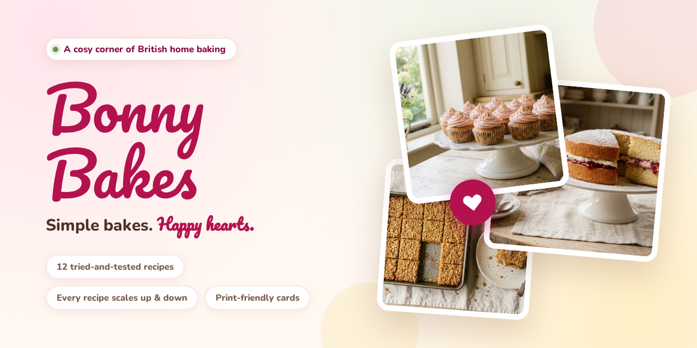
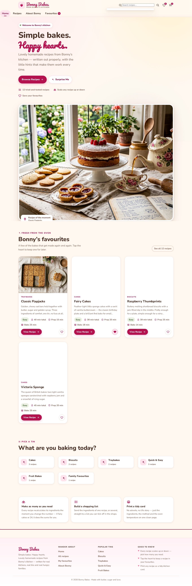
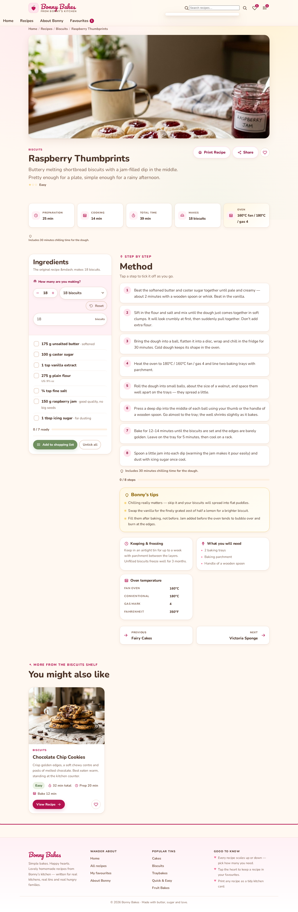

# 🍰 Bonny Bakes

> **👉 Live site: [dlinacre.github.io/bonny-bakes](https://dlinacre.github.io/bonny-bakes/)**

**Simple bakes. Happy hearts.** — a warm, friendly home-baking website full of
lovely recipes from Bonny's kitchen, written for real kitchens, real tins and
real hungry families.

Built with plain HTML5, CSS3 and vanilla JavaScript — no frameworks, no build
step, no backend. It works by simply opening `index.html` in a browser, and it
hosts beautifully on GitHub Pages.

---

## ✨ What's inside

| Feature | What it does |
| --- | --- |
| **12 traditional recipes** | Flapjacks, fairy cakes, Victoria sponge, lemon drizzle, rock cakes and more — full ingredients, method, timings, oven temperatures, tips and storage advice. |
| **Quantity calculator** | Every recipe recalculates all ingredients the moment you change the yield — with proper fractions (½, ¼, ⅓) and helpful notes for awkward amounts like "1½ eggs". |
| **Tick-as-you-bake** | Tick ingredients and tap method steps to mark them done, with gentle progress bars. |
| **Favourites ♥** | Save recipes with the heart button. Kept safely in your browser (localStorage) — no account needed. |
| **Shopping list** | Send any recipe's ingredients to a list, add your own bits, tick them off, print the list. Matching ingredients combine intelligently. |
| **Live search & filters** | Search by name, ingredient or category; filter by tin; sort by time, name or ease. |
| **Print-friendly cards** | One click prints a clean, traditional recipe card — no nav, no clutter. |
| **Share** | Native share sheet where available, with a copy-link fallback. |
| **Accessible & responsive** | Keyboard friendly, ARIA labels, skip link, reduced-motion support, and mobile-first layout from small phones to big screens. |

### Screenshots

| Home | Recipe page |
| --- | --- |
|  |  |

---

## 🚀 Quick start

**On your own computer:** download this repository and double-click
`index.html`. That's it — favourites and the shopping list are remembered by
your browser.

**On the web (GitHub Pages):**
1. In your repository, open **Settings → Pages**.
2. Under *Build and deployment*, choose **Deploy from a branch** → branch
   `main` → folder `/ (root)` → **Save**.
3. After a minute or two your site is live at
   `https://dlinacre.github.io/bonny-bakes/` — a link you can send to
   anyone.

---

## 🧁 How to add a new recipe

Recipes live in **one single data file**: [`recipes.js`](recipes.js).
Nothing else needs to change — cards, search, filters, scaling, printing and
the shopping list are all built from that data automatically.

1. Open `recipes.js` and copy any recipe object (everything from `{` to `},`).
2. Paste it into the `RECIPES` list — anywhere you like.
3. Give it a new `id` (lowercase and dashes, e.g. `'gingerbread-men'`).
4. Edit `name`, `description`, `category`, `image`, `servings`,
   `ingredients`, `method`, `timings`, `oven`, `tips` and `storage`.
5. Drop a photo into `images/` with the same name as the `image.file` field
   (e.g. `images/gingerbread-men.jpg`).
6. Save, refresh — done.

Every field is explained in the big comment at the top of `recipes.js`,
including how to write ingredients so the quantity calculator can scale them
(`{ q: 200, u: 'g', n: 'plain flour' }`), how to mark things that shouldn't
scale (`fixed: true`), and how to add optional US equivalents (`us: '1¾ cups'`).

### Swapping a photograph

Photos live in [`images/`](images/), one per recipe. Replace any file with your
own photo of the same name and the site picks it up automatically — no code
changes. If a photo is missing, the site shows a friendly branded placeholder
instead of breaking.

---

## 🗂 Project structure

```
bonny-bakes/
├── index.html        ← the page shell (header, footer, icon set)
├── style.css         ← every visual thing; design tokens at the top
├── recipes.js        ← ★ all recipe data + "how to add a recipe" guide
├── script.js         ← behaviour: scaling, search, favourites, list, print
├── images/           ← one photo per recipe (+ hero + about)
├── assets/           ← banner, icons, README screenshots
└── tools/            ← the automated browser test & asset renderer
```

## 🧪 Tests

The site ships with an automated check-suite that drives a real headless
browser (Playwright) through every feature — scaling maths included:

```bash
pip install playwright && python -m playwright install chromium
python tools/test_site.py
```

## 📜 Credits & licence

- **Type:** *Pacifico* and *Nunito* via Google Fonts (SIL Open Font License),
  with warm system-font fallbacks so the site also works fully offline.
- **Photography:** the current photos are generated stand-ins so the site
  looks its best out of the box. They are placeholders — swap in your own
  pictures any time (see above).
- **Code & recipes:** released under the [MIT Licence](LICENSE).

Made with butter, sugar and love. 💗
